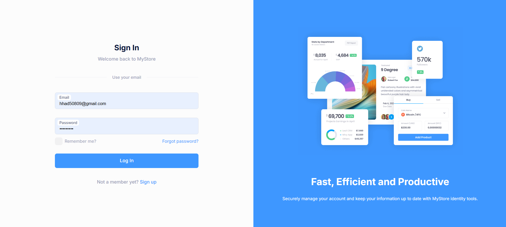
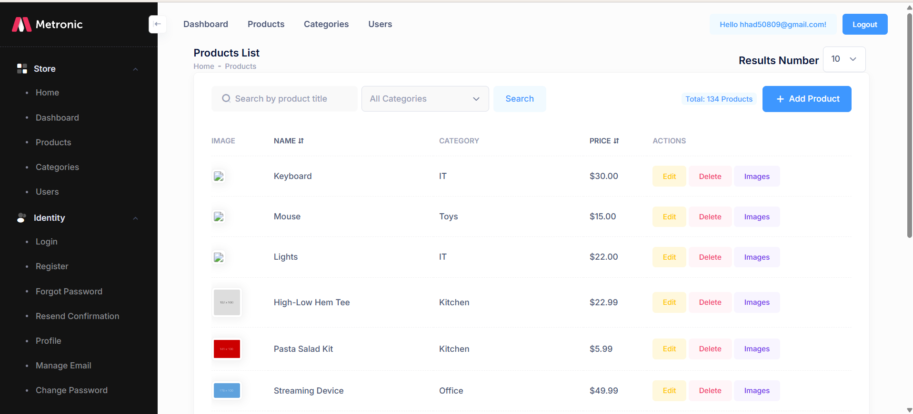
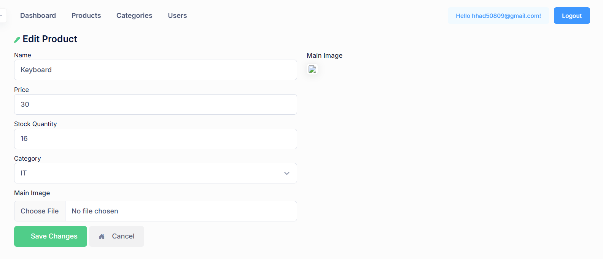

<div align="center">

# MyStore
### E-Commerce Admin Panel

*Self-built product and category management system.*


</div>

---

## 📋 About

An e-commerce admin panel for managing products and categories — built as part of my backend-focused coursework, where the main learning goal was the data layer and business logic, not UI design from scratch.

## 🖼️ Screenshots

<table>
<tr>
<td width="50%">

**Sign In**



</td>
<td width="50%">

**Products List**
Search, filter by category, and manage stock.



</td>
</tr>
<tr>
<td width="50%" colspan="2">

**Edit Product**
Bound directly to the `Product` model — name, price, stock, category, and image.



</td>
</tr>
</table>

## 🏗️ What I Built

**Backend — written entirely by me:**
- EF Core models with proper relationships (`Product`, `Category`, `ProductImages`, custom `AppUser`)
- Full CRUD logic for products and categories
- Multi-image support per product
- Soft-delete pattern (`IsDeleted`) instead of hard deletes
- ASP.NET Identity integration with a custom user class
- Data validation on all models

**Frontend:**
- Adapted from a shared admin-panel template (sidebar navigation, data tables, form layout), customized to match this project's data model and workflows. UI structure isn't original — the logic behind every screen is.

## 🧩 Core Models

| Model | Purpose |
|---|---|
| `Product` | Name, price, stock quantity, category, images |
| `Category` | Product categorization |
| `ProductImages` | Multiple images per product |
| `AppUser` | Custom Identity user |

## ⚙️ Tech Stack

| Layer | Technology |
|---|---|
| Backend | ASP.NET Core (Razor Pages) |
| ORM | Entity Framework Core |
| Auth | ASP.NET Identity |
| Database | SQL Server |

## 🚀 Running Locally

```bash
git clone https://github.com/HadeelZaqout/MyStore-Ecommerce-Admin.git
cd MyStore-Ecommerce-Admin
```

1. Update the connection string in `appsettings.json`
2. Run `dotnet ef database update`
3. Run the project

---

<div align="center">

Backend built solo by [Hadeel Zaqout](https://github.com/HadeelZaqout)

</div>
